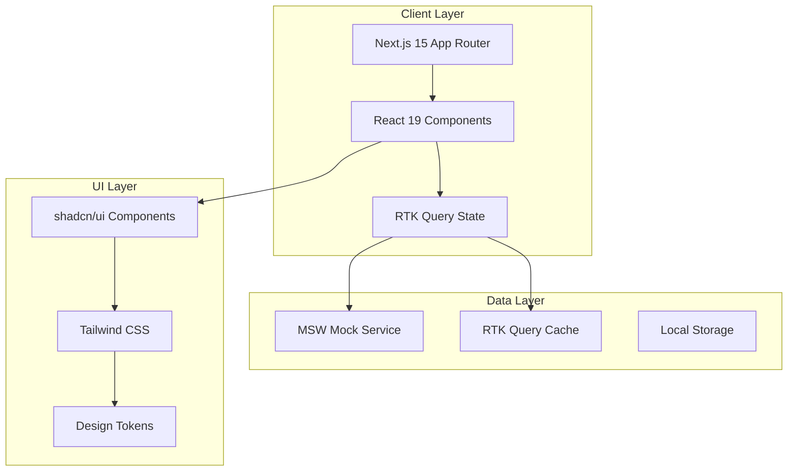

# Architecture Overview

This directory contains the technical architecture documentation for the PRIMA Partner Dashboard prototype.

## 📁 Architecture Documentation

- [Technical Stack](./technical-stack.md) - Core technologies, dependencies, and version requirements
- [Routing & Information Architecture](./routing-ia.md) - App Router structure, route groups, and navigation
- [State Management](./state-management.md) - RTK Query setup, cache strategies, and data flow
- [PWA Configuration](./pwa-setup.md) - Progressive Web App implementation and offline strategies
- [Performance Guidelines](./performance.md) - Performance budgets, optimization strategies, and monitoring

## 🏗️ High-Level Architecture



## 🎯 Core Principles

1. **Modular Architecture**: Feature-based organization under `(prima)` route group
2. **Type Safety**: Comprehensive TypeScript coverage with strict mode
3. **Performance First**: Optimistic updates, caching, and lazy loading
4. **Accessibility**: WCAG 2.1 AA compliance throughout
5. **Maintainability**: Clear separation of concerns and consistent patterns

## 🔧 Technology Decisions

### Frontend Framework
- **Next.js 15** with App Router for file-based routing and RSC support
- **React 19** for latest features and performance improvements
- **TypeScript** for type safety and developer experience

### State Management
- **RTK Query** for server state management and caching
- **React Context** for client-side state (theme, user preferences)
- **URL State** for shareable application state

### UI & Styling
- **shadcn/ui** for consistent, accessible component library
- **Tailwind CSS** for utility-first styling
- **CSS Variables** for design token system
- **Lucide React** for iconography

### Data & Mocking
- **MSW (Mock Service Worker)** for API mocking and development
- **TanStack Table** for advanced table functionality
- **React Hook Form** with Zod validation for forms

### Build & Deployment
- **Vercel** for hosting and preview deployments
- **PWA** configuration for offline functionality
- **TypeScript** strict mode for enhanced type checking

## 📦 Project Structure

```
src/
├── app/
│   ├── (auth)/                 # Authentication routes
│   ├── (dashboard)/            # Existing dashboard routes
│   ├── (prima)/               # PRIMA-specific routes
│   │   ├── layout.tsx         # PRIMA shell with global controls
│   │   ├── overview/          # KPI dashboard
│   │   ├── bookings/          # Booking management
│   │   ├── pricing/           # Pricing configuration
│   │   ├── promoters/         # Promoter management
│   │   ├── incentives/        # Incentive programs
│   │   ├── commissions/       # Commission management
│   │   ├── finance/           # Financial overview
│   │   ├── team/              # RBAC preview
│   │   └── settings/          # PRIMA settings
│   ├── globals.css            # Global styles and tokens
│   └── layout.tsx             # Root layout
├── components/
│   ├── ui/                    # shadcn/ui components
│   ├── layout/                # Layout components
│   └── prima/                 # PRIMA-specific components
├── lib/
│   ├── store/                 # RTK Query store setup
│   ├── api/                   # API slice definitions
│   ├── mocks/                 # MSW handlers and data
│   └── utils.ts               # Utility functions
└── types/                     # TypeScript type definitions
```

## 🔄 Data Flow

1. **User Interaction** triggers component events
2. **RTK Query** dispatches API calls to MSW handlers
3. **MSW** returns mock data with realistic latency
4. **RTK Cache** stores and normalizes responses
5. **Components** re-render with updated state
6. **Optimistic Updates** provide immediate feedback
7. **URL State** maintains shareable application state

## 🚀 Performance Strategy

- **Code Splitting**: Route-based and component-based lazy loading
- **Caching**: Aggressive RTK Query caching with selective invalidation
- **Virtualization**: Large lists with TanStack Table virtualization
- **Optimizations**: React 19 features, memo strategies, and bundle analysis

---

For detailed implementation guidance, see the individual architecture documents in this directory.
