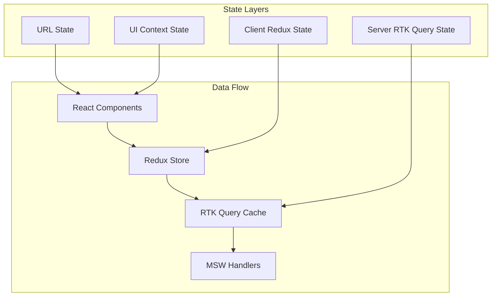

# State Management

Comprehensive guide to state management architecture using RTK Query, Redux Toolkit, and React Context for the PRIMA Partner Dashboard.

## 🏗️ State Architecture Overview

The application uses a layered state management approach:

1. **Server State** - RTK Query for API data and caching
2. **Client State** - Redux Toolkit for complex client state
3. **UI State** - React Context for theme, preferences, and UI state
4. **URL State** - Search parameters for shareable application state



## 🗄️ Store Configuration

### Root Store Setup

```typescript
// src/lib/store/index.ts
import { configureStore } from '@reduxjs/toolkit'
import { setupListeners } from '@reduxjs/toolkit/query'
import { primaApi } from './api'
import { uiSlice } from './slices/ui'
import { authSlice } from './slices/auth'

export const store = configureStore({
  reducer: {
    // RTK Query API
    [primaApi.reducerPath]: primaApi.reducer,
    
    // Client state slices
    ui: uiSlice.reducer,
    auth: authSlice.reducer,
  },
  middleware: (getDefaultMiddleware) =>
    getDefaultMiddleware({
      serializableCheck: {
        ignoredActions: [FLUSH, REHYDRATE, PAUSE, PERSIST, PURGE, REGISTER],
      },
    }).concat(primaApi.middleware),
  devTools: process.env.NODE_ENV !== 'production',
})

// Enable refetch on focus/reconnect
setupListeners(store.dispatch)

export type RootState = ReturnType<typeof store.getState>
export type AppDispatch = typeof store.dispatch
```

### Store Provider

```tsx
// src/app/providers.tsx
'use client'

import { Provider } from 'react-redux'
import { store } from '@/lib/store'

export function Providers({ children }: { children: React.ReactNode }) {
  return (
    <Provider store={store}>
      {children}
    </Provider>
  )
}
```

## 🔌 RTK Query API Setup

### Base API Configuration

```typescript
// src/lib/store/api/index.ts
import { createApi, fetchBaseQuery } from '@reduxjs/toolkit/query/react'
import type { RootState } from '../index'

export const primaApi = createApi({
  reducerPath: 'primaApi',
  baseQuery: fetchBaseQuery({
    baseUrl: '/api',
    prepareHeaders: (headers, { getState }) => {
      const token = (getState() as RootState).auth.token
      
      if (token) {
        headers.set('authorization', `Bearer ${token}`)
      }
      
      // Add demo role for prototype
      headers.set('x-demo-role', 'ADMIN')
      
      return headers
    },
  }),
  tagTypes: [
    'Booking',
    'Venue',
    'Promoter', 
    'Incentive',
    'Commission',
    'Finance',
    'User',
    'Metrics',
    'Pricing',
  ],
  endpoints: () => ({}),
})
```

### API Slice Structure

Each domain has its own API slice that extends the base API:

```typescript
// src/lib/store/api/bookings.ts
import { primaApi } from './index'
import type { Booking, BookingFilters, BookingUpdate } from '@/types/bookings'

export const bookingsApi = primaApi.injectEndpoints({
  endpoints: (builder) => ({
    getBookings: builder.query<
      { items: Booking[]; total: number },
      BookingFilters
    >({
      query: (filters) => ({
        url: '/bookings',
        params: filters,
      }),
      providesTags: ['Booking'],
      // Transform response for client consumption
      transformResponse: (response: any) => ({
        items: response.items.map(transformBooking),
        total: response.total,
      }),
    }),
    
    updateBooking: builder.mutation<Booking, BookingUpdate>({
      query: ({ id, ...update }) => ({
        url: `/bookings/${id}`,
        method: 'PATCH',
        body: update,
      }),
      invalidatesTags: ['Booking', 'Metrics'],
      // Optimistic update
      onQueryStarted: async ({ id, ...update }, { dispatch, queryFulfilled }) => {
        const patchResult = dispatch(
          bookingsApi.util.updateQueryData('getBookings', {}, (draft) => {
            const booking = draft.items.find((b) => b.id === id)
            if (booking) {
              Object.assign(booking, update)
            }
          })
        )
        
        try {
          await queryFulfilled
        } catch {
          patchResult.undo()
        }
      },
    }),
  }),
})

export const { useGetBookingsQuery, useUpdateBookingMutation } = bookingsApi
```

## 📊 Domain API Slices

### Overview/Metrics API

```typescript
// src/lib/store/api/metrics.ts
export const metricsApi = primaApi.injectEndpoints({
  endpoints: (builder) => ({
    getOverviewMetrics: builder.query<OverviewMetrics, MetricsFilters>({
      query: (filters) => ({
        url: '/metrics/overview',
        params: filters,
      }),
      providesTags: ['Metrics'],
      // Cache for 5 minutes, refetch on window focus
      keepUnusedDataFor: 300,
    }),
    
    getWeeklyTrends: builder.query<WeeklyTrend[], TrendFilters>({
      query: (filters) => ({
        url: '/metrics/trends/weekly',
        params: filters,
      }),
      providesTags: ['Metrics'],
    }),
  }),
})
```

### Promoters API

```typescript
// src/lib/store/api/promoters.ts
export const promotersApi = primaApi.injectEndpoints({
  endpoints: (builder) => ({
    getPromoters: builder.query<PromoterList, PromoterFilters>({
      query: (filters) => ({
        url: '/promoters',
        params: filters,
      }),
      providesTags: ['Promoter'],
    }),
    
    getPromoterDetail: builder.query<PromoterDetail, string>({
      query: (id) => `/promoters/${id}`,
      providesTags: (result, error, id) => [{ type: 'Promoter', id }],
    }),
    
    updateCommissionAssignment: builder.mutation<
      CommissionAssignment,
      { promoterId: string; assignment: CommissionAssignment }
    >({
      query: ({ promoterId, assignment }) => ({
        url: `/commissions/assignments/${promoterId}`,
        method: 'PUT',
        body: assignment,
      }),
      invalidatesTags: ['Promoter', 'Commission'],
    }),
  }),
})
```

### Pricing API

```typescript
// src/lib/store/api/pricing.ts
export const pricingApi = primaApi.injectEndpoints({
  endpoints: (builder) => ({
    getVenuePricing: builder.query<VenuePricing, string>({
      query: (venueId) => `/venues/${venueId}/pricing`,
      providesTags: (result, error, venueId) => [
        { type: 'Pricing', id: venueId }
      ],
    }),
    
    updateVenuePricing: builder.mutation<
      VenuePricing,
      { venueId: string; pricing: PricingUpdate }
    >({
      query: ({ venueId, pricing }) => ({
        url: `/venues/${venueId}/pricing`,
        method: 'PUT',
        body: pricing,
      }),
      invalidatesTags: ['Pricing', 'Metrics', 'Finance'],
    }),
    
    calculatePricingExamples: builder.query<
      PricingExample[],
      { venueId: string; pricing: PricingUpdate }
    >({
      query: ({ venueId, pricing }) => ({
        url: `/venues/${venueId}/pricing/examples`,
        method: 'POST',
        body: pricing,
      }),
      // Don't cache examples, always fetch fresh
      keepUnusedDataFor: 0,
    }),
  }),
})
```

### Finance API

```typescript
// src/lib/store/api/finance.ts
export const financeApi = primaApi.injectEndpoints({
  endpoints: (builder) => ({
    getFinanceSummary: builder.query<FinanceSummary, FinanceFilters>({
      query: (filters) => ({
        url: '/finance/summary',
        params: filters,
      }),
      providesTags: ['Finance'],
    }),
    
    createPayoutHold: builder.mutation<
      PayoutHold,
      { promoterId: string; reason: string; amount?: number }
    >({
      query: (hold) => ({
        url: '/finance/holds',
        method: 'POST',
        body: hold,
      }),
      invalidatesTags: ['Finance', 'Promoter'],
    }),
  }),
})
```

## 🎛️ Client State Management

### UI State Slice

```typescript
// src/lib/store/slices/ui.ts
import { createSlice, type PayloadAction } from '@reduxjs/toolkit'

interface UIState {
  theme: 'light' | 'dark' | 'system'
  sidebarCollapsed: boolean
  selectedVenue: string | null
  dateRange: {
    from: Date | null
    to: Date | null
  }
  exportCenter: {
    isOpen: boolean
    selectedFormat: 'csv' | 'excel' | 'pdf'
  }
}

const initialState: UIState = {
  theme: 'system',
  sidebarCollapsed: false,
  selectedVenue: null,
  dateRange: {
    from: null,
    to: null,
  },
  exportCenter: {
    isOpen: false,
    selectedFormat: 'csv',
  },
}

export const uiSlice = createSlice({
  name: 'ui',
  initialState,
  reducers: {
    setTheme: (state, action: PayloadAction<UIState['theme']>) => {
      state.theme = action.payload
    },
    toggleSidebar: (state) => {
      state.sidebarCollapsed = !state.sidebarCollapsed
    },
    setSelectedVenue: (state, action: PayloadAction<string | null>) => {
      state.selectedVenue = action.payload
    },
    setDateRange: (state, action: PayloadAction<UIState['dateRange']>) => {
      state.dateRange = action.payload
    },
    toggleExportCenter: (state) => {
      state.exportCenter.isOpen = !state.exportCenter.isOpen
    },
    setExportFormat: (state, action: PayloadAction<UIState['exportCenter']['selectedFormat']>) => {
      state.exportCenter.selectedFormat = action.payload
    },
  },
})

export const {
  setTheme,
  toggleSidebar,
  setSelectedVenue,
  setDateRange,
  toggleExportCenter,
  setExportFormat,
} = uiSlice.actions
```

## 🔗 React Context for UI State

### PRIMA Context Provider

```tsx
// src/app/(prima)/providers/prima-context.tsx
'use client'

import { createContext, useContext, useReducer, type ReactNode } from 'react'
import { useSearchParams } from 'next/navigation'

interface PrimaContextState {
  venueId: string | null
  dateRange: { from: Date | null; to: Date | null }
  filters: Record<string, any>
  view: string | null
}

type PrimaContextAction =
  | { type: 'SET_VENUE'; payload: string | null }
  | { type: 'SET_DATE_RANGE'; payload: { from: Date | null; to: Date | null } }
  | { type: 'SET_FILTERS'; payload: Record<string, any> }
  | { type: 'SET_VIEW'; payload: string | null }

const PrimaContext = createContext<{
  state: PrimaContextState
  dispatch: React.Dispatch<PrimaContextAction>
} | null>(null)

function primaReducer(state: PrimaContextState, action: PrimaContextAction): PrimaContextState {
  switch (action.type) {
    case 'SET_VENUE':
      return { ...state, venueId: action.payload }
    case 'SET_DATE_RANGE':
      return { ...state, dateRange: action.payload }
    case 'SET_FILTERS':
      return { ...state, filters: action.payload }
    case 'SET_VIEW':
      return { ...state, view: action.payload }
    default:
      return state
  }
}

export function PrimaProvider({ children }: { children: ReactNode }) {
  const searchParams = useSearchParams()
  
  const initialState: PrimaContextState = {
    venueId: searchParams.get('venueId'),
    dateRange: {
      from: searchParams.get('from') ? new Date(searchParams.get('from')!) : null,
      to: searchParams.get('to') ? new Date(searchParams.get('to')!) : null,
    },
    filters: {},
    view: searchParams.get('view'),
  }
  
  const [state, dispatch] = useReducer(primaReducer, initialState)
  
  return (
    <PrimaContext.Provider value={{ state, dispatch }}>
      {children}
    </PrimaContext.Provider>
  )
}

export function usePrimaContext() {
  const context = useContext(PrimaContext)
  if (!context) {
    throw new Error('usePrimaContext must be used within PrimaProvider')
  }
  return context
}
```

## 🔄 Data Flow Patterns

### Optimistic Updates

```typescript
// Example: Optimistic booking status update
const useOptimisticBookingUpdate = () => {
  const [updateBooking] = useUpdateBookingMutation()
  
  const updateBookingStatus = async (id: string, status: BookingStatus) => {
    try {
      await updateBooking({ id, status }).unwrap()
      // Show success toast
      toast.success('Booking updated successfully')
    } catch (error) {
      // Error handling is automatic via RTK Query
      toast.error('Failed to update booking')
    }
  }
  
  return { updateBookingStatus }
}
```

### Selective Cache Invalidation

```typescript
// Smart cache invalidation based on data relationships
const useSmartCacheInvalidation = () => {
  const dispatch = useAppDispatch()
  
  const invalidateRelatedData = (entity: string, id: string) => {
    switch (entity) {
      case 'booking':
        // Invalidate metrics, finance, and promoter data
        dispatch(primaApi.util.invalidateTags(['Metrics', 'Finance', 'Promoter']))
        break
      case 'pricing':
        // Invalidate metrics and finance projections
        dispatch(primaApi.util.invalidateTags(['Metrics', 'Finance']))
        break
      case 'commission':
        // Invalidate promoter and finance data
        dispatch(primaApi.util.invalidateTags(['Promoter', 'Finance']))
        break
    }
  }
  
  return { invalidateRelatedData }
}
```

### Cross-Module Data Synchronization

```typescript
// Sync data across modules using RTK Query cache
const useCrossModuleSync = () => {
  const bookingsData = useGetBookingsQuery({})
  const metricsData = useGetOverviewMetricsQuery({})
  
  // Automatically sync when booking data changes
  useEffect(() => {
    if (bookingsData.isSuccess) {
      // Trigger metrics recalculation
      dispatch(metricsApi.util.invalidateTags(['Metrics']))
    }
  }, [bookingsData.data, dispatch])
  
  return {
    isLoading: bookingsData.isLoading || metricsData.isLoading,
    isError: bookingsData.isError || metricsData.isError,
  }
}
```

## 🎯 Performance Optimization

### Cache Configuration

```typescript
// Optimized cache configuration for different data types
const cacheConfig = {
  // High-frequency data - short cache time
  bookings: { keepUnusedDataFor: 60 }, // 1 minute
  
  // Medium-frequency data - moderate cache time  
  promoters: { keepUnusedDataFor: 300 }, // 5 minutes
  metrics: { keepUnusedDataFor: 300 }, // 5 minutes
  
  // Low-frequency data - long cache time
  venues: { keepUnusedDataFor: 3600 }, // 1 hour
  pricing: { keepUnusedDataFor: 1800 }, // 30 minutes
  
  // Reference data - very long cache time
  commissionTiers: { keepUnusedDataFor: 7200 }, // 2 hours
}
```

### Selective Subscriptions

```typescript
// Subscribe to data only when needed
const useConditionalSubscription = (shouldSubscribe: boolean) => {
  const result = useGetBookingsQuery({}, {
    skip: !shouldSubscribe,
    pollingInterval: shouldSubscribe ? 30000 : 0, // Poll every 30s when active
  })
  
  return result
}
```

---

This state management architecture provides a scalable, performant foundation for the PRIMA Partner Dashboard with clear separation of concerns, optimistic updates, and intelligent caching strategies.
