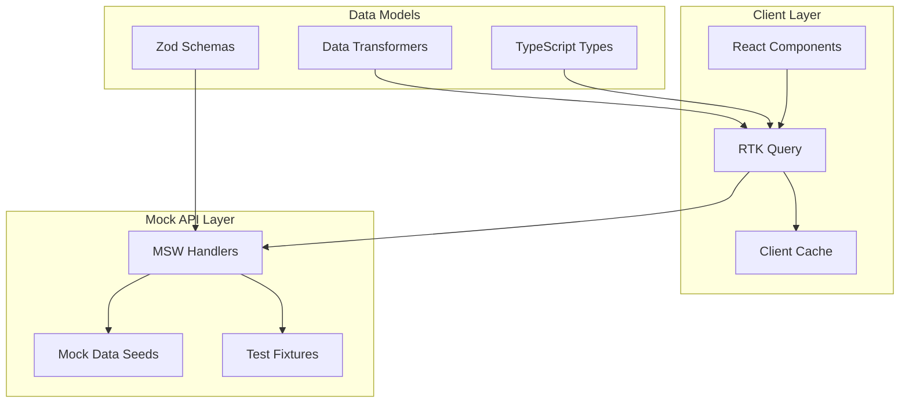

# Data Models & API Documentation

Comprehensive documentation for data models, API contracts, and Mock Service Worker (MSW) setup for the PRIMA Partner Dashboard.

## 📁 Data Documentation

- [Data Models](./models.md) - Complete TypeScript type definitions and interfaces
- [API Contracts](./api-contracts.md) - REST API specifications and request/response schemas
- [MSW Setup](./msw-setup.md) - Mock Service Worker configuration and handlers
- [Mock Data](./mock-data.md) - Realistic test data patterns and generation strategies
- [Database Schema](./schema.md) - Logical data relationships and constraints

## 🏗️ Data Architecture Overview

The PRIMA Partner Dashboard uses a client-side data architecture with mocked APIs for prototype development:



## 📊 Core Data Domains

### 1. Venues & Configuration
- **Venue** - Physical locations and settings
- **Pricing** - Prime/Non-Prime pricing configurations
- **Settings** - Venue-specific preferences and rules

### 2. Bookings & Reservations
- **Booking** - Individual reservation records
- **Guest** - Customer information and history
- **BookingHistory** - Status change audit trail

### 3. Promoters & Performance
- **Promoter** - Promoter profiles and contact information
- **PromoterPerformance** - Metrics and KPIs per promoter
- **CommissionAssignment** - Promoter commission tier assignments

### 4. Financial Management
- **Transaction** - Financial transaction records
- **Payout** - Scheduled and completed payouts
- **CommissionRate** - Tier-based commission structures
- **Hold** - Payout holds and restrictions

### 5. Incentives & Programs
- **Incentive** - Promoter incentive program definitions
- **IncentiveProgress** - Real-time progress tracking
- **Reward** - Completed incentive rewards

### 6. Users & Access Control
- **User** - System user accounts and profiles
- **Role** - Permission-based access control
- **AuditLog** - System activity tracking

## 🔗 Data Relationships

### Primary Relationships
```typescript
// Core entity relationships
interface DataRelationships {
  Venue: {
    hasMany: ['Booking', 'Pricing', 'User']
    belongsTo: []
  }
  
  Booking: {
    belongsTo: ['Venue', 'Promoter', 'Guest']
    hasMany: ['Transaction', 'BookingHistory']
  }
  
  Promoter: {
    belongsTo: ['Venue']
    hasMany: ['Booking', 'CommissionAssignment', 'IncentiveProgress']
  }
  
  Transaction: {
    belongsTo: ['Booking', 'Promoter', 'Venue']
    hasMany: []
  }
  
  Incentive: {
    belongsTo: ['Venue']
    hasMany: ['IncentiveProgress']
  }
}
```

### Foreign Key Constraints
```typescript
interface ForeignKeys {
  'booking.venueId': 'venue.id'
  'booking.promoterId': 'promoter.id'
  'booking.guestId': 'guest.id'
  'transaction.bookingId': 'booking.id'
  'commissionAssignment.promoterId': 'promoter.id'
  'incentiveProgress.incentiveId': 'incentive.id'
  'incentiveProgress.promoterId': 'promoter.id'
}
```

## 📈 Mock Data Strategy

### Realistic Data Patterns
The mock data follows realistic business patterns:

- **Venue Performance**: 60/20/20 split (Prime/Non-Prime/Cancelled)
- **Revenue Distribution**: Pareto principle (80/20 promoter performance)
- **Booking Patterns**: Seasonal trends and day-of-week variations
- **Commission Tiers**: Standard/Premium/VIP distribution
- **Financial Timing**: Realistic payout schedules and hold patterns

### Data Generation Rules
```typescript
interface MockDataRules {
  venues: {
    count: 3
    types: ['Restaurant', 'Hotel', 'Event Space']
    capacityRange: [50, 300]
  }
  
  promoters: {
    count: 25
    performanceDistribution: {
      top: 0.2    // 20% high performers
      mid: 0.6    // 60% average performers  
      low: 0.2    // 20% low performers
    }
  }
  
  bookings: {
    perMonth: 40
    primeRatio: 0.6
    statusDistribution: {
      confirmed: 0.85
      cancelled: 0.10
      noShow: 0.05
    }
  }
  
  financial: {
    platformFee: 0.10
    payoutSchedule: 'weekly'
    holdRate: 0.05  // 5% of payouts held
  }
}
```

### Time-Based Data
```typescript
interface TimeBasedPatterns {
  // Booking patterns by day of week
  dayOfWeekMultipliers: {
    monday: 0.7
    tuesday: 0.8
    wednesday: 0.9
    thursday: 1.1
    friday: 1.4
    saturday: 1.6
    sunday: 1.2
  }
  
  // Seasonal adjustments
  monthlyMultipliers: {
    january: 0.8
    february: 0.9
    march: 1.1
    // ... realistic seasonal patterns
  }
  
  // Time of day preferences
  hourlyDistribution: {
    lunch: [11, 12, 13, 14]      // 40% of bookings
    dinner: [17, 18, 19, 20, 21] // 60% of bookings
  }
}
```

## 🔧 API Response Patterns

### Standard Response Format
```typescript
interface APIResponse<T> {
  success: boolean
  data: T
  meta?: {
    total?: number
    page?: number
    size?: number
    hasNext?: boolean
  }
  errors?: APIError[]
  timestamp: string
}

interface APIError {
  code: string
  message: string
  field?: string
  details?: Record<string, any>
}
```

### Pagination Pattern
```typescript
interface PaginatedResponse<T> {
  items: T[]
  total: number
  page: number
  size: number
  hasNext: boolean
  hasPrevious: boolean
  totalPages: number
}
```

### Filter Response Pattern
```typescript
interface FilterableResponse<T> {
  items: T[]
  total: number
  filters: {
    applied: Record<string, any>
    available: {
      [key: string]: FilterOption[]
    }
  }
  sorts: {
    applied: SortOption[]
    available: SortOption[]
  }
}

interface FilterOption {
  value: string
  label: string
  count: number
}
```

## ⚡ Performance Considerations

### Cache Strategy
```typescript
interface CacheConfiguration {
  // High-frequency data - short cache
  bookings: { ttl: 60 }        // 1 minute
  metrics: { ttl: 300 }        // 5 minutes
  
  // Medium-frequency data
  promoters: { ttl: 900 }      // 15 minutes
  finance: { ttl: 1800 }       // 30 minutes
  
  // Low-frequency data - long cache
  venues: { ttl: 3600 }        // 1 hour
  pricing: { ttl: 3600 }       // 1 hour
  
  // Reference data - very long cache
  commissionTiers: { ttl: 86400 } // 24 hours
}
```

### Data Loading Patterns
```typescript
interface LoadingPatterns {
  // Critical path - load immediately
  overview: ['metrics', 'recentBookings']
  
  // Secondary data - load after critical path
  bookings: ['filters', 'promoters', 'venues']
  
  // Lazy load - load on demand
  analytics: ['trends', 'comparisons', 'exports']
  
  // Background refresh - periodic updates
  realtime: ['notifications', 'counters', 'alerts']
}
```

## 🔍 Data Validation

### Runtime Validation
All API responses are validated using Zod schemas:

```typescript
import { z } from 'zod'

const BookingSchema = z.object({
  id: z.string().uuid(),
  venueId: z.string().uuid(),
  promoterId: z.string().uuid().optional(),
  guestName: z.string().min(1),
  diners: z.number().int().min(1).max(20),
  status: z.enum(['PENDING', 'CONFIRMED', 'CANCELLED', 'NO_SHOW']),
  createdAt: z.string().datetime(),
  // ... complete schema
})

type Booking = z.infer<typeof BookingSchema>
```

### API Contract Testing
```typescript
// Validate API responses match expected schemas
describe('API Contract Validation', () => {
  test('GET /api/bookings returns valid booking data', async () => {
    const response = await fetch('/api/bookings')
    const data = await response.json()
    
    expect(() => {
      BookingListSchema.parse(data)
    }).not.toThrow()
  })
})
```

## 🧪 Testing Data

### Test Fixtures
Predefined data sets for consistent testing:

```typescript
export const testFixtures = {
  venues: {
    restaurant: createVenue({ type: 'restaurant', capacity: 100 }),
    hotel: createVenue({ type: 'hotel', capacity: 200 }),
    eventSpace: createVenue({ type: 'event', capacity: 300 }),
  },
  
  promoters: {
    topPerformer: createPromoter({ tier: 'VIP', bookingsThisMonth: 50 }),
    averagePerformer: createPromoter({ tier: 'STANDARD', bookingsThisMonth: 15 }),
    newPromoter: createPromoter({ tier: 'STANDARD', bookingsThisMonth: 2 }),
  },
  
  bookings: {
    confirmed: createBooking({ status: 'CONFIRMED', type: 'PRIME' }),
    cancelled: createBooking({ status: 'CANCELLED', type: 'NON_PRIME' }),
    noShow: createBooking({ status: 'NO_SHOW', type: 'PRIME' }),
  },
}
```

### Scenario-Based Data
```typescript
export const scenarios = {
  // High-volume venue with multiple promoters
  busyRestaurant: {
    venue: testFixtures.venues.restaurant,
    promoters: [/* 10 active promoters */],
    bookings: [/* 200 bookings this month */],
    incentives: [/* 3 active incentive programs */],
  },
  
  // New venue just starting out
  newVenue: {
    venue: createVenue({ createdAt: '2025-01-01' }),
    promoters: [/* 2 promoters */],
    bookings: [/* 10 bookings total */],
    incentives: [],
  },
}
```

---

This data architecture provides a robust foundation for the PRIMA Partner Dashboard prototype with realistic data patterns, comprehensive validation, and efficient caching strategies.
