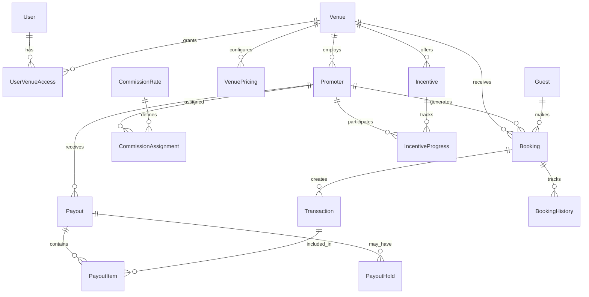

# Database Schema & Relationships

Logical data model and relationships for the PRIMA Partner Dashboard, defining entity relationships, constraints, and data integrity rules for the prototype.

## 🗄️ Schema Overview

The PRIMA data model supports multi-venue portfolio management with comprehensive tracking of bookings, promoters, financial transactions, and performance metrics.

## 📊 Entity Relationship Diagram



## 🏢 Core Entities

### User Management

#### User
```sql
TABLE users {
  id: UUID PRIMARY KEY
  email: VARCHAR(255) UNIQUE NOT NULL
  password_hash: VARCHAR(255) NOT NULL
  first_name: VARCHAR(100) NOT NULL
  last_name: VARCHAR(100) NOT NULL
  phone: VARCHAR(20)
  role: ENUM('ADMIN', 'MANAGER', 'COORDINATOR', 'VIEWER') NOT NULL
  status: ENUM('ACTIVE', 'INACTIVE', 'SUSPENDED') DEFAULT 'ACTIVE'
  email_verified: BOOLEAN DEFAULT FALSE
  two_factor_enabled: BOOLEAN DEFAULT FALSE
  preferences: JSONB
  last_login_at: TIMESTAMP
  created_at: TIMESTAMP DEFAULT NOW()
  updated_at: TIMESTAMP DEFAULT NOW()
  
  INDEXES:
    - email
    - role
    - status
}
```

#### UserVenueAccess
```sql
TABLE user_venue_access {
  id: UUID PRIMARY KEY
  user_id: UUID NOT NULL REFERENCES users(id) ON DELETE CASCADE
  venue_id: UUID NOT NULL REFERENCES venues(id) ON DELETE CASCADE
  role: ENUM('OWNER', 'ADMIN', 'MANAGER', 'COORDINATOR') NOT NULL
  granted_by: UUID REFERENCES users(id)
  granted_at: TIMESTAMP DEFAULT NOW()
  revoked_at: TIMESTAMP
  
  UNIQUE(user_id, venue_id)
  
  INDEXES:
    - user_id
    - venue_id
    - role
}
```

### Venue Management

#### Venue
```sql
TABLE venues {
  id: UUID PRIMARY KEY
  name: VARCHAR(255) NOT NULL
  type: ENUM('RESTAURANT', 'HOTEL', 'EVENT_SPACE', 'BAR', 'CAFE', 'OTHER') NOT NULL
  tier: ENUM('CASUAL', 'MID_TIER', 'HIGH_END', 'PREMIUM') NOT NULL
  
  -- Location data
  address_street: VARCHAR(255) NOT NULL
  address_city: VARCHAR(100) NOT NULL
  address_state: VARCHAR(50) NOT NULL
  address_zip: VARCHAR(20) NOT NULL
  address_country: VARCHAR(50) DEFAULT 'US'
  coordinates_lat: DECIMAL(10, 8)
  coordinates_lng: DECIMAL(11, 8)
  timezone: VARCHAR(50) DEFAULT 'America/New_York'
  
  -- Contact information
  contact_phone: VARCHAR(20)
  contact_email: VARCHAR(255)
  contact_website: VARCHAR(255)
  
  -- Capacity information
  capacity_seated: INTEGER NOT NULL
  capacity_standing: INTEGER
  capacity_private: INTEGER
  
  -- Operational settings
  currency: VARCHAR(3) DEFAULT 'USD'
  language: VARCHAR(5) DEFAULT 'en'
  auto_confirm_bookings: BOOLEAN DEFAULT TRUE
  require_approval: BOOLEAN DEFAULT FALSE
  
  -- Business metrics
  average_daily_bookings: INTEGER DEFAULT 15
  prime_ratio: DECIMAL(3, 2) DEFAULT 0.60
  average_booking_value: DECIMAL(10, 2) DEFAULT 120.00
  
  status: ENUM('ACTIVE', 'INACTIVE', 'PENDING') DEFAULT 'ACTIVE'
  created_at: TIMESTAMP DEFAULT NOW()
  updated_at: TIMESTAMP DEFAULT NOW()
  
  INDEXES:
    - name
    - type
    - tier
    - status
    - address_city
}
```

#### VenuePricing
```sql
TABLE venue_pricing {
  id: UUID PRIMARY KEY
  venue_id: UUID NOT NULL REFERENCES venues(id) ON DELETE CASCADE
  
  -- Non-Prime pricing
  non_prime_per_diner: DECIMAL(8, 2) NOT NULL
  non_prime_platform_fee_percent: DECIMAL(5, 4) DEFAULT 0.1000
  
  -- Prime pricing
  prime_base_for_2: DECIMAL(8, 2) NOT NULL
  prime_additional_per_person: DECIMAL(8, 2) NOT NULL
  prime_platform_fee_percent: DECIMAL(5, 4) DEFAULT 0.1000
  
  -- Minimums and limits
  minimum_booking_amount: DECIMAL(8, 2) DEFAULT 0.00
  minimum_party_size: INTEGER DEFAULT 1
  maximum_party_size: INTEGER DEFAULT 20
  
  -- Discounts (optional)
  early_bird_discount_percent: DECIMAL(5, 4)
  repeat_customer_discount_percent: DECIMAL(5, 4)
  group_discount_percent: DECIMAL(5, 4)
  
  effective_from: TIMESTAMP DEFAULT NOW()
  effective_to: TIMESTAMP
  is_active: BOOLEAN DEFAULT TRUE
  updated_by: UUID REFERENCES users(id)
  created_at: TIMESTAMP DEFAULT NOW()
  updated_at: TIMESTAMP DEFAULT NOW()
  
  UNIQUE(venue_id, effective_from) WHERE is_active = TRUE
  
  INDEXES:
    - venue_id
    - effective_from
    - is_active
}
```

### Guest Management

#### Guest
```sql
TABLE guests {
  id: UUID PRIMARY KEY
  first_name: VARCHAR(100) NOT NULL
  last_name: VARCHAR(100) NOT NULL
  email: VARCHAR(255) NOT NULL
  phone: VARCHAR(20)
  
  -- Demographics (optional)
  birth_date: DATE
  gender: ENUM('MALE', 'FEMALE', 'OTHER', 'PREFER_NOT_TO_SAY')
  
  -- Preferences
  dietary_restrictions: TEXT[]
  seating_preference: ENUM('INDOOR', 'OUTDOOR', 'BAR', 'PRIVATE')
  communication_email: BOOLEAN DEFAULT TRUE
  communication_sms: BOOLEAN DEFAULT TRUE
  communication_push: BOOLEAN DEFAULT TRUE
  
  -- Aggregated metrics
  total_bookings: INTEGER DEFAULT 0
  cancelled_bookings: INTEGER DEFAULT 0
  no_show_bookings: INTEGER DEFAULT 0
  total_spent: DECIMAL(12, 2) DEFAULT 0.00
  average_party_size: DECIMAL(3, 1) DEFAULT 2.0
  last_booking_at: TIMESTAMP
  
  status: ENUM('ACTIVE', 'BLOCKED', 'VIP') DEFAULT 'ACTIVE'
  tags: TEXT[]
  created_at: TIMESTAMP DEFAULT NOW()
  updated_at: TIMESTAMP DEFAULT NOW()
  
  INDEXES:
    - email
    - phone
    - status
    - last_booking_at
    - total_spent
}
```

### Booking Management

#### Booking
```sql
TABLE bookings {
  id: UUID PRIMARY KEY
  venue_id: UUID NOT NULL REFERENCES venues(id)
  promoter_id: UUID REFERENCES promoters(id)
  guest_id: UUID NOT NULL REFERENCES guests(id)
  
  -- Booking details
  diners: INTEGER NOT NULL CHECK (diners > 0 AND diners <= 50)
  booking_time: TIMESTAMP NOT NULL
  duration_minutes: INTEGER DEFAULT 120
  special_requests: TEXT
  notes: TEXT
  
  -- Classification
  type: ENUM('PRIME', 'NON_PRIME') NOT NULL
  source: ENUM('DIRECT', 'PROMOTER', 'PARTNER', 'WALK_IN', 'PHONE') NOT NULL
  status: ENUM('PENDING', 'CONFIRMED', 'CANCELLED', 'NO_SHOW', 'COMPLETED') NOT NULL
  
  -- Financial
  base_fee: DECIMAL(10, 2) NOT NULL
  platform_fee: DECIMAL(10, 2) NOT NULL
  total_fee: DECIMAL(10, 2) NOT NULL
  promoter_commission: DECIMAL(10, 2) DEFAULT 0.00
  
  -- Status tracking
  confirmed_at: TIMESTAMP
  cancelled_at: TIMESTAMP
  no_show_at: TIMESTAMP
  completed_at: TIMESTAMP
  
  -- Metadata
  ip_address: INET
  user_agent: TEXT
  referrer: VARCHAR(255)
  
  created_at: TIMESTAMP DEFAULT NOW()
  updated_at: TIMESTAMP DEFAULT NOW()
  
  INDEXES:
    - venue_id
    - promoter_id
    - guest_id
    - booking_time
    - status
    - type
    - source
    - created_at
    - (venue_id, booking_time)
    - (promoter_id, booking_time)
    - (status, booking_time)
}
```

#### BookingHistory
```sql
TABLE booking_history {
  id: UUID PRIMARY KEY
  booking_id: UUID NOT NULL REFERENCES bookings(id) ON DELETE CASCADE
  action: VARCHAR(50) NOT NULL
  previous_value: JSONB
  new_value: JSONB
  reason: TEXT
  performed_by_id: UUID REFERENCES users(id)
  performed_by_name: VARCHAR(255) NOT NULL
  performed_by_role: VARCHAR(50) NOT NULL
  timestamp: TIMESTAMP DEFAULT NOW()
  metadata: JSONB
  
  INDEXES:
    - booking_id
    - action
    - timestamp
    - performed_by_id
}
```

### Promoter Management

#### Promoter
```sql
TABLE promoters {
  id: UUID PRIMARY KEY
  venue_id: UUID NOT NULL REFERENCES venues(id) -- Primary venue
  
  -- Personal information
  first_name: VARCHAR(100) NOT NULL
  last_name: VARCHAR(100) NOT NULL
  email: VARCHAR(255) NOT NULL
  phone: VARCHAR(20)
  
  -- Professional details
  title: VARCHAR(100)
  company: VARCHAR(255)
  bio: TEXT
  
  -- Social media (stored as JSONB for flexibility)
  social_media: JSONB
  
  -- Performance metrics (aggregated)
  total_bookings: INTEGER DEFAULT 0
  total_revenue: DECIMAL(12, 2) DEFAULT 0.00
  average_booking_value: DECIMAL(10, 2) DEFAULT 0.00
  conversion_rate: DECIMAL(5, 4) DEFAULT 0.0000
  no_show_rate: DECIMAL(5, 4) DEFAULT 0.0000
  cancel_rate: DECIMAL(5, 4) DEFAULT 0.0000
  
  -- Current month metrics
  month_bookings: INTEGER DEFAULT 0
  month_revenue: DECIMAL(12, 2) DEFAULT 0.00
  month_new_guests: INTEGER DEFAULT 0
  month_repeat_guests: INTEGER DEFAULT 0
  
  status: ENUM('ACTIVE', 'INACTIVE', 'SUSPENDED', 'PENDING_APPROVAL') DEFAULT 'PENDING_APPROVAL'
  tier: ENUM('STANDARD', 'PREMIUM', 'VIP') DEFAULT 'STANDARD'
  joined_at: TIMESTAMP DEFAULT NOW()
  last_active_at: TIMESTAMP
  created_at: TIMESTAMP DEFAULT NOW()
  updated_at: TIMESTAMP DEFAULT NOW()
  
  INDEXES:
    - venue_id
    - email
    - status
    - tier
    - total_bookings
    - total_revenue
    - conversion_rate
    - last_active_at
}
```

### Commission Management

#### CommissionRate
```sql
TABLE commission_rates {
  id: UUID PRIMARY KEY
  venue_id: UUID NOT NULL REFERENCES venues(id)
  tier: ENUM('STANDARD', 'PREMIUM', 'VIP') NOT NULL
  model: ENUM('PER_COVER', 'PERCENT_OF_SPEND', 'FLAT_RATE', 'TIERED') NOT NULL
  
  -- Rate configuration
  value: DECIMAL(10, 4) NOT NULL -- Amount or percentage
  minimum_booking: DECIMAL(8, 2) DEFAULT 0.00
  maximum_payout: DECIMAL(8, 2)
  
  -- Conditions for eligibility
  min_monthly_bookings: INTEGER
  min_conversion_rate: DECIMAL(5, 4)
  max_cancel_rate: DECIMAL(5, 4)
  
  -- Validity period
  effective_from: TIMESTAMP DEFAULT NOW()
  effective_to: TIMESTAMP
  is_active: BOOLEAN DEFAULT TRUE
  
  created_by: UUID NOT NULL REFERENCES users(id)
  created_at: TIMESTAMP DEFAULT NOW()
  updated_at: TIMESTAMP DEFAULT NOW()
  
  UNIQUE(venue_id, tier, model, effective_from) WHERE is_active = TRUE
  
  INDEXES:
    - venue_id
    - tier
    - model
    - effective_from
    - is_active
}
```

#### CommissionAssignment
```sql
TABLE commission_assignments {
  id: UUID PRIMARY KEY
  promoter_id: UUID NOT NULL REFERENCES promoters(id) ON DELETE CASCADE
  commission_rate_id: UUID NOT NULL REFERENCES commission_rates(id)
  
  tier: ENUM('STANDARD', 'PREMIUM', 'VIP') NOT NULL
  model: ENUM('PER_COVER', 'PERCENT_OF_SPEND', 'FLAT_RATE', 'TIERED') NOT NULL
  rate: DECIMAL(10, 4) NOT NULL
  
  effective_from: TIMESTAMP DEFAULT NOW()
  effective_to: TIMESTAMP
  assigned_by: UUID NOT NULL REFERENCES users(id)
  assigned_at: TIMESTAMP DEFAULT NOW()
  notes: TEXT
  
  INDEXES:
    - promoter_id
    - commission_rate_id
    - tier
    - effective_from
    - assigned_by
}
```

### Financial Management

#### Transaction
```sql
TABLE transactions {
  id: UUID PRIMARY KEY
  booking_id: UUID NOT NULL REFERENCES bookings(id)
  promoter_id: UUID REFERENCES promoters(id)
  venue_id: UUID NOT NULL REFERENCES venues(id)
  
  -- Transaction details
  type: ENUM('BOOKING_FEE', 'PLATFORM_FEE', 'PROMOTER_COMMISSION', 'REFUND', 'ADJUSTMENT', 'INCENTIVE_PAYOUT') NOT NULL
  amount: DECIMAL(10, 2) NOT NULL
  currency: VARCHAR(3) DEFAULT 'USD'
  description: TEXT NOT NULL
  
  -- Commission details (when applicable)
  commission_rate: DECIMAL(5, 4)
  commission_amount: DECIMAL(10, 2)
  commission_tier: ENUM('STANDARD', 'PREMIUM', 'VIP')
  
  -- Processing status
  status: ENUM('PENDING', 'CONFIRMED', 'SETTLED', 'FAILED', 'CANCELLED') DEFAULT 'PENDING'
  processed_at: TIMESTAMP
  settled_at: TIMESTAMP
  
  -- External references
  external_transaction_id: VARCHAR(255)
  payout_id: UUID REFERENCES payouts(id)
  
  created_at: TIMESTAMP DEFAULT NOW()
  updated_at: TIMESTAMP DEFAULT NOW()
  
  INDEXES:
    - booking_id
    - promoter_id
    - venue_id
    - type
    - status
    - payout_id
    - processed_at
    - created_at
}
```

#### Payout
```sql
TABLE payouts {
  id: UUID PRIMARY KEY
  venue_id: UUID NOT NULL REFERENCES venues(id)
  promoter_id: UUID REFERENCES promoters(id)
  
  -- Payout details
  amount: DECIMAL(10, 2) NOT NULL
  currency: VARCHAR(3) DEFAULT 'USD'
  period_from: TIMESTAMP NOT NULL
  period_to: TIMESTAMP NOT NULL
  
  -- Status and scheduling
  status: ENUM('DRAFT', 'PENDING_APPROVAL', 'APPROVED', 'PROCESSING', 'COMPLETED', 'FAILED') DEFAULT 'DRAFT'
  scheduled_for: TIMESTAMP NOT NULL
  processed_at: TIMESTAMP
  
  -- Breakdown
  commissions_amount: DECIMAL(10, 2) DEFAULT 0.00
  incentives_amount: DECIMAL(10, 2) DEFAULT 0.00
  adjustments_amount: DECIMAL(10, 2) DEFAULT 0.00
  fees_amount: DECIMAL(10, 2) DEFAULT 0.00
  
  -- Processing details
  method: ENUM('BANK_TRANSFER', 'CHECK', 'DIGITAL_WALLET') DEFAULT 'BANK_TRANSFER'
  reference: VARCHAR(255)
  
  -- Approval workflow
  approved_by: UUID REFERENCES users(id)
  approved_at: TIMESTAMP
  
  created_at: TIMESTAMP DEFAULT NOW()
  updated_at: TIMESTAMP DEFAULT NOW()
  
  INDEXES:
    - venue_id
    - promoter_id
    - status
    - scheduled_for
    - period_from
    - period_to
    - processed_at
}
```

#### PayoutHold
```sql
TABLE payout_holds {
  id: UUID PRIMARY KEY
  payout_id: UUID NOT NULL REFERENCES payouts(id) ON DELETE CASCADE
  amount: DECIMAL(10, 2) NOT NULL
  reason: TEXT NOT NULL
  hold_until: TIMESTAMP
  
  created_by: UUID NOT NULL REFERENCES users(id)
  created_at: TIMESTAMP DEFAULT NOW()
  released_by: UUID REFERENCES users(id)
  released_at: TIMESTAMP
  
  INDEXES:
    - payout_id
    - created_by
    - hold_until
    - released_at
}
```

### Incentive Management

#### Incentive
```sql
TABLE incentives {
  id: UUID PRIMARY KEY
  venue_id: UUID NOT NULL REFERENCES venues(id)
  
  -- Program details
  name: VARCHAR(255) NOT NULL
  description: TEXT
  type: ENUM('BOOKING_COUNT', 'REVENUE_TARGET', 'NEW_GUESTS', 'CONVERSION_RATE') NOT NULL
  
  -- Target configuration
  target_metric: VARCHAR(50) NOT NULL
  target_threshold: DECIMAL(10, 2) NOT NULL
  target_comparison: ENUM('GREATER_THAN', 'GREATER_EQUAL', 'EQUAL', 'TOP_N') NOT NULL
  
  -- Reward configuration
  reward_type: ENUM('FIXED_AMOUNT', 'PERCENTAGE_BONUS', 'TIER_UPGRADE') NOT NULL
  reward_value: DECIMAL(10, 2) NOT NULL
  reward_currency: VARCHAR(3) DEFAULT 'USD'
  reward_description: TEXT
  
  -- Period definition
  period_type: ENUM('WEEKLY', 'MONTHLY', 'QUARTERLY', 'CUSTOM') NOT NULL
  period_start: TIMESTAMP NOT NULL
  period_end: TIMESTAMP NOT NULL
  is_recurring: BOOLEAN DEFAULT FALSE
  
  -- Eligibility rules
  eligible_tiers: ENUM('STANDARD', 'PREMIUM', 'VIP')[] DEFAULT ARRAY['STANDARD', 'PREMIUM', 'VIP']
  min_tenure_days: INTEGER DEFAULT 0
  max_previous_wins: INTEGER
  
  -- Program status
  status: ENUM('DRAFT', 'ACTIVE', 'PAUSED', 'COMPLETED', 'CANCELLED') DEFAULT 'DRAFT'
  
  -- Tracking
  participant_count: INTEGER DEFAULT 0
  winner_count: INTEGER DEFAULT 0
  total_payout: DECIMAL(12, 2) DEFAULT 0.00
  
  created_by: UUID NOT NULL REFERENCES users(id)
  created_at: TIMESTAMP DEFAULT NOW()
  updated_at: TIMESTAMP DEFAULT NOW()
  
  INDEXES:
    - venue_id
    - type
    - status
    - period_start
    - period_end
    - created_by
}
```

#### IncentiveProgress
```sql
TABLE incentive_progress {
  id: UUID PRIMARY KEY
  incentive_id: UUID NOT NULL REFERENCES incentives(id) ON DELETE CASCADE
  promoter_id: UUID NOT NULL REFERENCES promoters(id) ON DELETE CASCADE
  
  -- Progress tracking
  current_value: DECIMAL(10, 2) DEFAULT 0.00
  target_value: DECIMAL(10, 2) NOT NULL
  percent_complete: DECIMAL(5, 2) DEFAULT 0.00
  
  -- Status
  status: ENUM('IN_PROGRESS', 'ACHIEVED', 'MISSED', 'DISQUALIFIED') DEFAULT 'IN_PROGRESS'
  achieved_at: TIMESTAMP
  
  -- Reward tracking
  reward_earned: DECIMAL(10, 2)
  reward_paid_at: TIMESTAMP
  
  last_updated: TIMESTAMP DEFAULT NOW()
  created_at: TIMESTAMP DEFAULT NOW()
  
  UNIQUE(incentive_id, promoter_id)
  
  INDEXES:
    - incentive_id
    - promoter_id
    - status
    - achieved_at
    - last_updated
}
```

## 🔐 Data Constraints & Business Rules

### Referential Integrity
```sql
-- Ensure venue access permissions
ALTER TABLE user_venue_access 
ADD CONSTRAINT check_venue_access_role 
CHECK (role IN ('OWNER', 'ADMIN', 'MANAGER', 'COORDINATOR'));

-- Ensure booking integrity
ALTER TABLE bookings 
ADD CONSTRAINT check_booking_time_future 
CHECK (booking_time > created_at);

ALTER TABLE bookings 
ADD CONSTRAINT check_diners_positive 
CHECK (diners > 0);

ALTER TABLE bookings 
ADD CONSTRAINT check_fee_positive 
CHECK (total_fee >= 0 AND platform_fee >= 0);

-- Ensure commission rate validity
ALTER TABLE commission_rates 
ADD CONSTRAINT check_commission_value_positive 
CHECK (value >= 0);

ALTER TABLE commission_rates 
ADD CONSTRAINT check_effective_period 
CHECK (effective_to IS NULL OR effective_to > effective_from);

-- Ensure payout integrity
ALTER TABLE payouts 
ADD CONSTRAINT check_payout_amount_positive 
CHECK (amount >= 0);

ALTER TABLE payouts 
ADD CONSTRAINT check_payout_period 
CHECK (period_to > period_from);
```

### Triggers for Data Consistency

#### Update Aggregated Metrics
```sql
-- Update promoter metrics when bookings change
CREATE OR REPLACE FUNCTION update_promoter_metrics()
RETURNS TRIGGER AS $$
BEGIN
  -- Update total bookings and revenue for the promoter
  UPDATE promoters SET
    total_bookings = (
      SELECT COUNT(*) FROM bookings 
      WHERE promoter_id = COALESCE(NEW.promoter_id, OLD.promoter_id)
      AND status = 'CONFIRMED'
    ),
    total_revenue = (
      SELECT COALESCE(SUM(total_fee), 0) FROM bookings 
      WHERE promoter_id = COALESCE(NEW.promoter_id, OLD.promoter_id)
      AND status = 'CONFIRMED'
    ),
    updated_at = NOW()
  WHERE id = COALESCE(NEW.promoter_id, OLD.promoter_id);
  
  RETURN COALESCE(NEW, OLD);
END;
$$ LANGUAGE plpgsql;

CREATE TRIGGER trigger_update_promoter_metrics
  AFTER INSERT OR UPDATE OR DELETE ON bookings
  FOR EACH ROW EXECUTE FUNCTION update_promoter_metrics();
```

#### Update Guest Metrics
```sql
CREATE OR REPLACE FUNCTION update_guest_metrics()
RETURNS TRIGGER AS $$
BEGIN
  UPDATE guests SET
    total_bookings = (
      SELECT COUNT(*) FROM bookings 
      WHERE guest_id = COALESCE(NEW.guest_id, OLD.guest_id)
    ),
    total_spent = (
      SELECT COALESCE(SUM(total_fee), 0) FROM bookings 
      WHERE guest_id = COALESCE(NEW.guest_id, OLD.guest_id)
      AND status = 'CONFIRMED'
    ),
    last_booking_at = (
      SELECT MAX(booking_time) FROM bookings 
      WHERE guest_id = COALESCE(NEW.guest_id, OLD.guest_id)
    ),
    updated_at = NOW()
  WHERE id = COALESCE(NEW.guest_id, OLD.guest_id);
  
  RETURN COALESCE(NEW, OLD);
END;
$$ LANGUAGE plpgsql;

CREATE TRIGGER trigger_update_guest_metrics
  AFTER INSERT OR UPDATE OR DELETE ON bookings
  FOR EACH ROW EXECUTE FUNCTION update_guest_metrics();
```

## 📈 Performance Indexes

### Optimized Query Patterns
```sql
-- Multi-venue dashboard queries
CREATE INDEX idx_bookings_venue_date_status 
ON bookings(venue_id, booking_time, status);

-- Promoter performance queries
CREATE INDEX idx_bookings_promoter_date_confirmed 
ON bookings(promoter_id, booking_time) 
WHERE status = 'CONFIRMED';

-- Financial reporting queries
CREATE INDEX idx_transactions_venue_date_type 
ON transactions(venue_id, created_at, type);

-- Payout processing queries
CREATE INDEX idx_payouts_scheduled_status 
ON payouts(scheduled_for, status);

-- Commission calculation queries
CREATE INDEX idx_commission_assignments_active 
ON commission_assignments(promoter_id, effective_from) 
WHERE effective_to IS NULL;
```

## 🔄 Data Partitioning Strategy

### Time-Based Partitioning for Large Tables
```sql
-- Partition bookings by month for performance
CREATE TABLE bookings_y2025m01 PARTITION OF bookings
FOR VALUES FROM ('2025-01-01') TO ('2025-02-01');

CREATE TABLE bookings_y2025m02 PARTITION OF bookings
FOR VALUES FROM ('2025-02-01') TO ('2025-03-01');

-- Partition transactions by quarter
CREATE TABLE transactions_2025_q1 PARTITION OF transactions
FOR VALUES FROM ('2025-01-01') TO ('2025-04-01');
```

## 🛡️ Data Security & Privacy

### Row-Level Security (RLS)
```sql
-- Enable RLS on sensitive tables
ALTER TABLE bookings ENABLE ROW LEVEL SECURITY;
ALTER TABLE promoters ENABLE ROW LEVEL SECURITY;
ALTER TABLE payouts ENABLE ROW LEVEL SECURITY;

-- Venue-based access control
CREATE POLICY venue_access_policy ON bookings
FOR ALL TO authenticated_users
USING (
  venue_id IN (
    SELECT venue_id FROM user_venue_access 
    WHERE user_id = current_user_id()
    AND revoked_at IS NULL
  )
);
```

### Data Masking for Different Roles
```sql
-- Create views with role-based data masking
CREATE VIEW bookings_manager AS
SELECT 
  id, venue_id, promoter_id,
  CASE 
    WHEN current_user_role() = 'ADMIN' THEN guest_name
    ELSE substring(guest_name, 1, 1) || '***'
  END as guest_name,
  diners, booking_time, status, type, total_fee
FROM bookings;
```

---

This schema provides a robust foundation for the PRIMA Partner Dashboard with proper relationships, constraints, and performance optimizations while maintaining data integrity and security.
