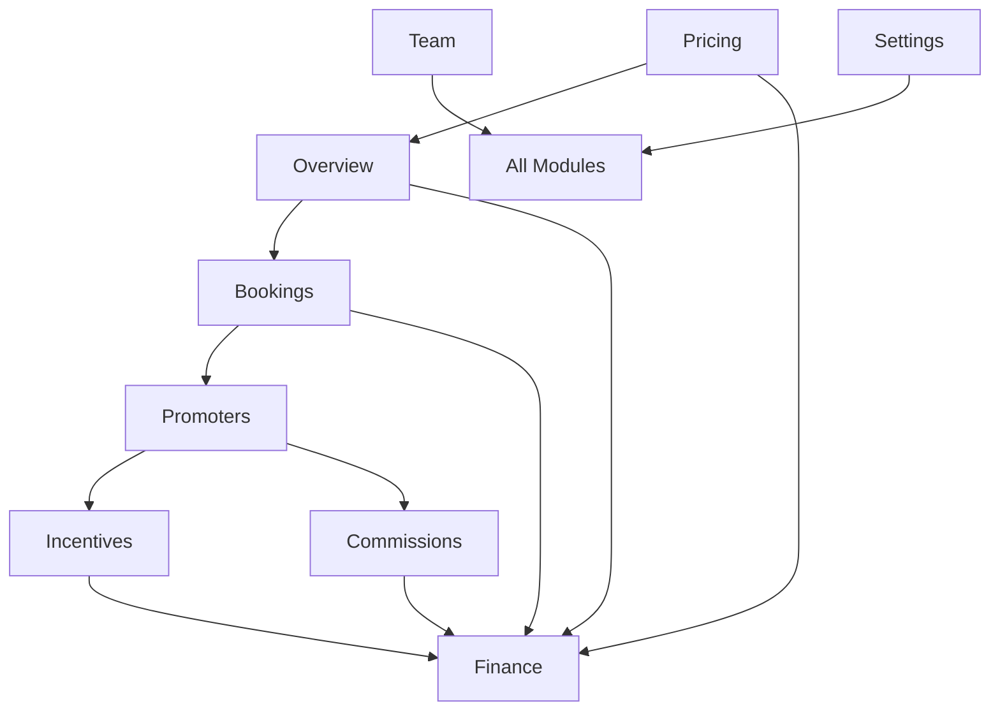

# PRIMA Module Specifications

Detailed specifications for each module in the PRIMA Partner Dashboard, including requirements, user journeys, and acceptance criteria.

## 📁 Module Documentation

- [Overview Dashboard](./overview.md) - KPI dashboard with drill-through capabilities
- [Bookings Management](./bookings.md) - Comprehensive booking management and status controls
- [Pricing Configuration](./pricing.md) - Prime/Non-Prime pricing setup with live calculations
- [Promoters Management](./promoters.md) - Leaderboard, performance tracking, and assignments
- [Incentives Programs](./incentives.md) - Create and manage promoter incentive programs
- [Commissions Management](./commissions.md) - Tiered commission structure and precedence
- [Finance & Payouts](./finance.md) - Financial overview, payout management, and holds
- [Team & RBAC](./team.md) - Role-based access control and user management preview
- [Settings](./settings.md) - Theme management and PRIMA configuration

## 🎯 Module Priorities

### Critical Path (W1)


1. **Overview** - Foundation KPI dashboard
2. **Bookings** - Core booking management functionality


### Wave 2 (W2)  

3. **Pricing** - Revenue optimization controls
4. **Finance** - Financial rollups and payout management
5. **Promoters** - Performance tracking and leaderboard


### Wave 3 (W3)

6. **Incentives** - Motivation and goal tracking
7. **Commissions** - Advanced commission management
8. **Team/RBAC** - Permission and access control preview
9. **Settings** - Configuration and theming

## 🔗 Module Interconnections




## 📊 Shared Components

### Global Controls

All modules share these common controls in the PRIMA layout:

- **Venue Selector** - Switch between venue contexts
- **Date Range Picker** - Filter data by time periods
- **Global Search** - Search across all PRIMA data
- **Export Center** - Export data in various formats
- **Theme Toggle** - Switch between light/dark themes

### Common UI Patterns

1. **KPI Cards** - Standardized metric display
2. **Data Tables** - Consistent table interactions and features
3. **Status Badges** - Unified status indication system
4. **Action Buttons** - Consistent action patterns
5. **Loading States** - Standardized loading and skeleton patterns
6. **Error States** - Consistent error handling and messaging

## 🎪 Demo User Journeys


The modules support these key demo scenarios:

### 1. Revenue Control

**Path**: Overview → Pricing → Overview


- View current revenue metrics

- Adjust Prime pricing configuration
- See projected impact on earnings
- Save and verify changes in Overview

### 2. Demand Activation  


**Path**: Promoters → Incentives → Finance


- Review promoter leaderboard performance
- Create new monthly booking bonus
- Track progress and accrual
- Verify bonus appears in next payout


### 3. Loss Management


**Path**: Overview → Bookings → Overview

- Notice discrepancy in KPIs
- Filter bookings to find issues
- Mark no-shows/cancellations

- Verify corrected metrics


### 4. Commission Strategy

**Path**: Promoters → Commissions → Promoters  

- Review promoter performance
- Configure VIP commission tier
- Preview margin impact
- Apply changes and verify in leaderboard

### 5. RBAC Preview

**Path**: Team → All Modules

- Switch between user roles
- Observe data masking differences
- Test permission restrictions
- Verify export watermarking

## 📋 Acceptance Criteria Matrix

| Module | Core Functionality | Data Integration | User Experience |

|--------|-------------------|------------------|-----------------|
| Overview | ✅ KPI tiles with drill-through | ✅ Real-time metric aggregation | ✅ Mobile-responsive layout |
| Bookings | ✅ Status management & filtering | ✅ Optimistic updates | ✅ Bulk operations support |
| Pricing | ✅ Live calculation preview | ✅ Impact on metrics/finance | ✅ Example scenarios |
| Promoters | ✅ Leaderboard with sorting | ✅ Performance history | ✅ Commission assignment |
| Incentives | ✅ Create/edit programs | ✅ Progress tracking | ✅ Auto-award integration |
| Commissions | ✅ Tier configuration | ✅ Precedence preview | ✅ Assignment management |
| Finance | ✅ Payout summaries | ✅ Hold management | ✅ Reconciliation views |
| Team | ✅ Role switching | ✅ Permission preview | ✅ Data masking demo |
| Settings | ✅ Theme management | ✅ Preference persistence | ✅ Configuration export |


## 🔄 Data Flow Between Modules

### Metrics Propagation

Changes in operational modules automatically update metrics:

```typescript
// Example: Booking status change propagates to Overview

Bookings.updateStatus() → 
  Metrics.recalculate() → 
  Overview.refresh() → 
  Finance.updateTotals()
```

### Cross-Module State Sync

Key state synchronization patterns:

1. **Venue Selection** - Propagates to all modules
2. **Date Range** - Filters all time-based data
3. **Role Changes** - Updates permissions and data visibility
4. **Theme Updates** - Applies across all modules instantly


### Cache Invalidation Strategy

Smart cache invalidation based on data relationships:

```typescript

const moduleInvalidationMap = {
  bookings: ['metrics', 'finance', 'promoters'],
  pricing: ['metrics', 'finance'],
  commissions: ['promoters', 'finance'],
  incentives: ['promoters', 'finance'],

}
```

## 🎯 Performance Targets

### Load Times (Per Module)

- **Initial Load**: < 2s
- **Route Transitions**: < 500ms  
- **Data Updates**: < 200ms
- **Table Operations**: < 100ms

### Responsiveness

- **Mobile First**: All modules optimized for mobile
- **Tablet Support**: Enhanced layouts for tablet viewports
- **Desktop**: Full feature sets with advanced interactions

### Accessibility

- **WCAG 2.1 AA**: All modules compliant
- **Keyboard Navigation**: Full keyboard accessibility
- **Screen Readers**: Proper ARIA labels and descriptions

---

Each module specification includes detailed requirements, API contracts, component specifications, and acceptance criteria. Use these as the definitive guide for implementation.
